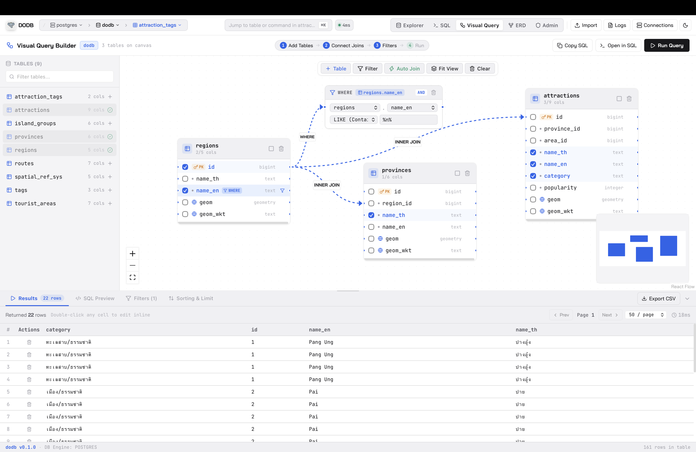
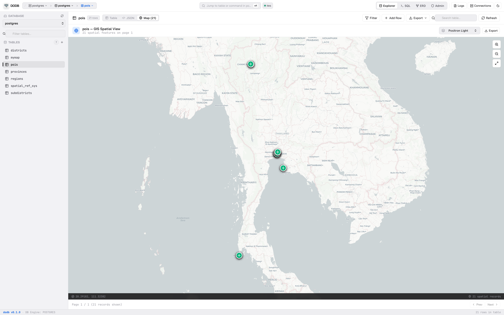
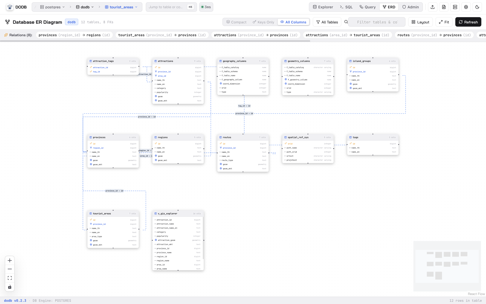
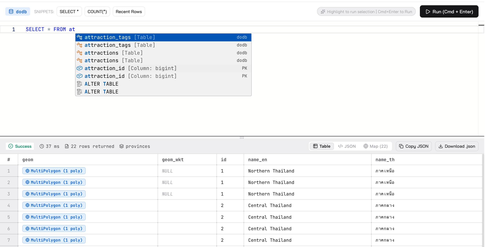
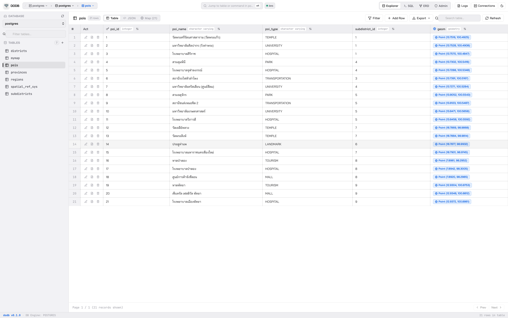
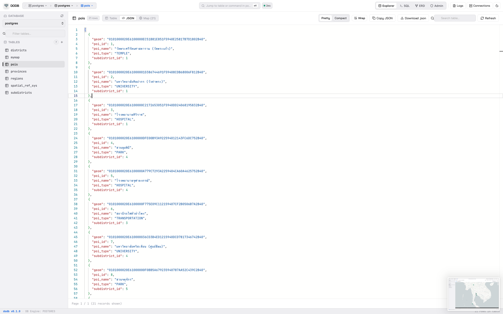
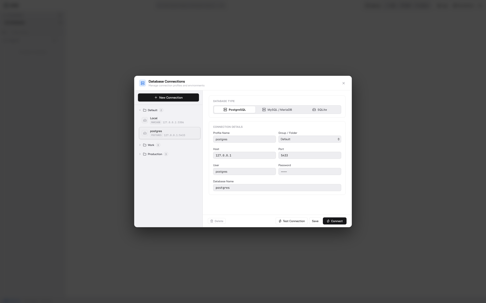

<p align="center">
  
</p>

<h1 align="center">dodb</h1>

<p align="center">
  <strong>A modern, native database manager for macOS with Visual Query Builder, PostGIS Maps, and ER Diagrams.</strong>
</p>

<p align="center">
  
  
  
  
  
</p>

<p align="center">
  
</p>

> **dodb — “ดู DB”** _(Doo DB)_  
> _See your data. Understand your database. Build queries visually._

**dodb** is a blazing-fast, lightweight native macOS database client built around a core philosophy: **working with a database should start with seeing it clearly.**

No bloated Java runtimes, no slow Electron shells, and no hidden cloud proxies. Just pure Rust performance, crisp macOS aesthetics, and modern visual workflow tools.

---

## ✨ Key Highlights

- 🎨 **Visual SQL Query Builder** — Compose complex SQL queries visually on an interactive canvas with table cards, drag-and-drop JOIN connections, and smart WHERE filter blocks.
- 🗺️ **GIS & Spatial Map Viewer** — Native PostGIS, MySQL Spatial, and SpatiaLite viewer powered by MapLibre GL with offline tile caching and coordinate picker.
- 🕸️ **Visual ER Diagrams** — Auto-generated entity relationship diagrams with foreign key topology and relationship highlighting.
- ⚡ **Monaco SQL Console** — Full-featured code editor with smart autocomplete, highlight-to-run (`Cmd + Enter`), and multi-tab results.
- 📝 **Virtual DataGrid & Inline Editing** — Instant double-click edits, staged transactional mutation bar, multi-select rows (`Cmd + Click`), and batch actions.
- 🔒 **Local & Direct Connection** — Direct socket connection with local AES-256-GCM encryption for stored credentials. Zero telemetry.

---

## 📸 Features & Walkthrough

### 1. Visual SQL Query Builder (Interactive Canvas)

Design complex SQL queries visually without writing raw SQL by hand.

- **Canvas Table Cards** — Drag & drop tables onto the canvas, select/deselect columns in `SELECT`, and inspect types.
- **Visual JOIN Cables** — Connect columns between tables with interactive animated cables supporting `INNER`, `LEFT`, `RIGHT`, and `FULL OUTER` joins.
- **Smart Auto-Join Suggestion** — Automatically detects matching primary and foreign keys to suggest joins.
- **Connected WHERE Filter Blocks** — Docked filter nodes linked directly to table columns with rich operators (`=`, `!=`, `>`, `<`, `LIKE`, `IN`, `IS NULL`).
- **Bi-directional SQL Synchronization** — Generates clean, formatted SQL in real time. Execute directly or send to Monaco Console with 1-click.

<p align="center">
  
</p>

---

### 2. GIS & Spatial Data Explorer (MapLibre GL)

First-class support for spatial databases with zero external GIS software required.

- **Engines Supported** — PostgreSQL/PostGIS (`geometry`, `geography`), MySQL Spatial (`POINT`, `POLYGON`, etc.), and SpatiaLite.
- **Universal Decoding** — Automatically parses WKT, GeoJSON, and EWKB/WKB Hex binary geometries.
- **Multi-Basemap & Tile Caching** — Fast offline raster tile caching with Dark Matter, Light Positron, OpenStreetMap, and Esri Satellite layers.
- **Coordinate Picker & Export** — Click anywhere on the map to pick coordinates or export features to standard `.geojson` files.

<p align="center">
  
</p>

---

### 3. Visual Schema & ER Diagram

Understand relationships across your entire database instantly.

- **Interactive Node Graph** — Powered by `@xyflow/react` to render tables, columns, and foreign key relationships.
- **Multi-directional Routing** — Clean, collision-free edge paths.
- **Search & Highlight** — Search tables and highlight connected foreign key links on click.

<p align="center">
  
</p>

---

### 4. Monaco SQL Console & Intelligent Autocomplete

Write and execute raw SQL with IDE-grade tools.

- **Monaco Editor** — Powered by VS Code's editor engine with schema-aware autocompletion for tables, columns, keywords, and SQL functions.
- **Highlight to Run** — Highlight any SQL query segment and execute only that text with `Cmd + Enter`.
- **Multi-Statement Engine** — Sequentially execute multi-statement SQL scripts with separate result tabs.
- **Execution Metrics** — Real-time query execution duration and affected row indicators.

<p align="center">
  
</p>

---

### 5. Interactive DataGrid & Transactional Staging

Explore and edit database records with safety and speed.

- **Virtual Data Grid** — Smooth 60fps scrolling across large datasets.
- **Cell Badges** — Distinct badges for DateTime, Booleans, JSON, Binary/BLOB, Enums, UUIDs, Primary Keys, and Spatial Geometries.
- **Transactional Staging Bar** — Review staged mutations (Insert, Update, Delete) with diff review and atomic rollback before committing.
- **Multi-Select & Batch Operations** — Select multiple rows or index ranges with `Cmd/Ctrl + Click` or `Shift + Click` for batch deletion or clipboard export.

<p align="center">
  
</p>

---

### 6. Detailed Inspector & JSON View / Export

- Right-click any row to inspect fields in full-screen modal with instant search and formatted JSON view.
- Modal record editor with NULL toggles and auto-increment handling.
- Fast export to JSON, CSV, and SQL `INSERT` statements.

<p align="center">
  
</p>

---

### 7. Profile & Connection Management

- Save and organize database connections with color tags and environment groups.
- Direct socket connections with local AES-256-GCM encryption for stored credentials.

<p align="center">
  
</p>

---

## 🗄️ Supported Database Engines

| Engine         | Supported Versions              | Spatial / GIS Capabilities                           |
| :------------- | :------------------------------ | :--------------------------------------------------- |
| **PostgreSQL** | 10, 11, 12, 13, 14, 15, 16, 17+ | PostGIS (`geometry`, `geography`, WKT, EWKB)         |
| **MySQL**      | 5.7, 8.0, 8.4, 9.0+             | MySQL Spatial (`GEOMETRY`, `POINT`, `POLYGON`, etc.) |
| **MariaDB**    | 10.3, 10.5, 10.11, 11.x+        | MariaDB Spatial Types                                |
| **SQLite**     | 3.x                             | SpatiaLite & WKT / GeoJSON                           |

---

## 🛠️ Architecture & Tech Stack

```
dodb/
├── src-tauri/          # High-performance native Rust core
│   ├── src/            # Database drivers (SQLx), encrypted storage, IPC
│   └── Cargo.toml
└── ui/                 # Modern Next.js frontend
    ├── src/components/ # Visual Query Builder, MapLibre GIS, Monaco Console, DataGrid
    └── src/pages/
```

- **Desktop Shell**: Tauri 2 (Lightweight, low memory footprint, native WebKit)
- **Application Core**: Rust · Tokio · SQLx (Direct async pooling)
- **Visual Canvas**: `@xyflow/react` (React Flow)
- **Map Engine**: MapLibre GL + Custom Offline Tile Cache Protocol
- **Editor**: Monaco Editor
- **UI Framework**: Next.js 16 (Turbopack) · React 19 · CSS Design System

---

## 🍏 macOS Installation & Gatekeeper Fix

When opening downloaded `.dmg` or `.app` releases on macOS without Apple Developer ID notarization, Gatekeeper may display a security prompt:

### วิธีแก้ไข / Quick Fix:

**Method 1: Terminal (Recommended / แนะนำ)**  
After copying `dodb.app` into `/Applications`, open **Terminal** and run:

```bash
xattr -cr /Applications/dodb.app
```

Then launch **dodb** normally from Applications or Spotlight (`Cmd + Space`).

**Method 2: Right-Click Open**

1. Open **Finder** → `/Applications`.
2. **Right-click** (or `Control + Click`) on **dodb.app**.
3. Click **Open** and confirm in the dialog.

---

## 💻 Development & Building

### Prerequisites

- macOS 11.0+ (Apple Silicon `aarch64` or Intel `x86_64`)
- Rust Toolchain: `curl --proto '=https' --tlsv1.2 -sSf https://sh.rustup.rs | sh`
- Node.js 18+ and `pnpm`: `npm install -g pnpm`

### Start Development Server

```bash
# Clone the repository
git clone https://github.com/bankjirapan/dodb.git
cd dodb

# Install dependencies
pnpm install

# Start development app (UI + Tauri)
pnpm dev
```

### Build Production Release (.dmg & .app)

```bash
pnpm build
```

The compiled bundles will be generated under `src-tauri/target/release/bundle/dmg/` and `src-tauri/target/release/bundle/macos/`.

---

## 📄 License

dodb is open-source software licensed under the [MIT License](LICENSE).

---

<p align="center">
  Crafted with ❤️ by <strong>thutil</strong>
  <br />
  <strong>dodb — See your data. Understand your database.</strong>
</p>
